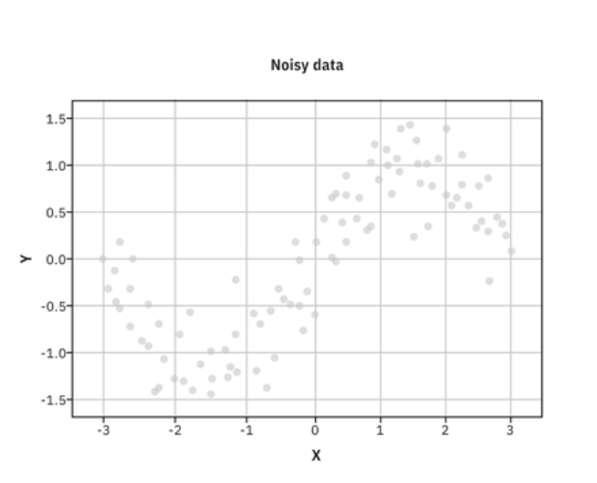
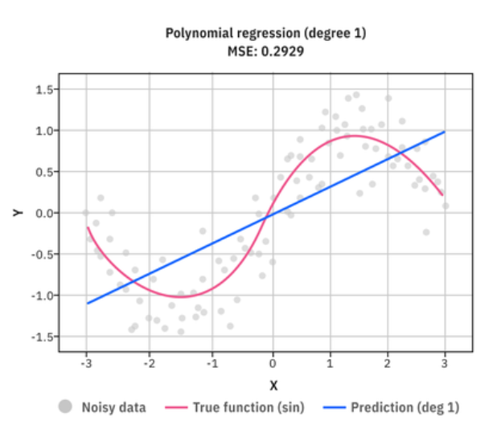
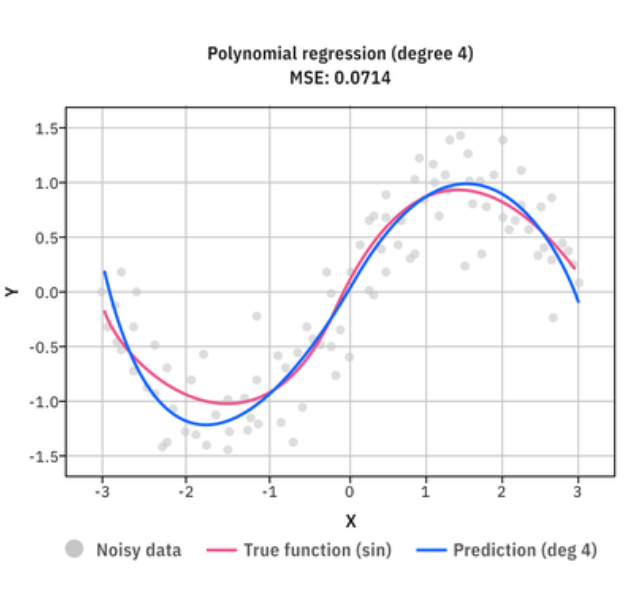
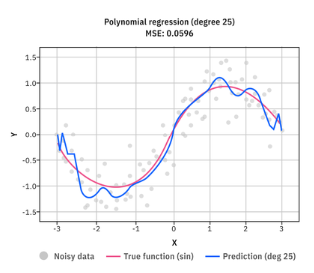

# bias variance tradoff

bias is how much predictions are far from actual true values. (during training as well as during testing)

variance is how much prediction changes as input data (training data) changes

> Imagine you collected your training dataset, trained a model, got predictions. Now imagine you went out and collected a completely new training dataset from the same problem (same distribution, different samples). You train again. Do the predictions change a lot

example, **linear regression model for non-linear data**

training data: set of input values X and corresponding output values Y. The true relationship between X and Y is nonlinear—think of a smooth, curved U-shape like a sine wave.

Linear Regression model on non-linear data

in above graph, we can

- bias is high i.e model cannot capture non-linear patterns in data
- Variance is low - doesn't change much with different dataset (variance is low because we already know, model does not learnt any patterns from first training data. so for new training data, model predicts in same way it predicted for previous training data)

**This is underfitting**

---

Then we use a bit complex model. It has moderate bias and moderate variance. This model best fits the data

- Bias is moderate: The model can represent the true function fairly well.
- Variance is moderate: It doesn’t overreact to small fluctuations in the data.

---

Then we use more complex model which has low bias (because it learns noise and outliers too) and has high variance (as data changes predictions changes a lot because it does not learn general signals or patterns BUT learn noise and whole dataset)

- Bias is low: because model learns not only general patterns but also outliers and noise signals which makes it very well for training data. (but does not perform well in testing)
- variance is high : as data changes ,predictions changes a lot because it does not learn general signals or patterns BUT learn noise and whole dataset

**This is overfitting**

> [!Note]  
> **_In practice, plot training loss vs. validation loss across epochs or model complexity, and that curve directly reveals where you sit on the bias-variance spectrum._**
