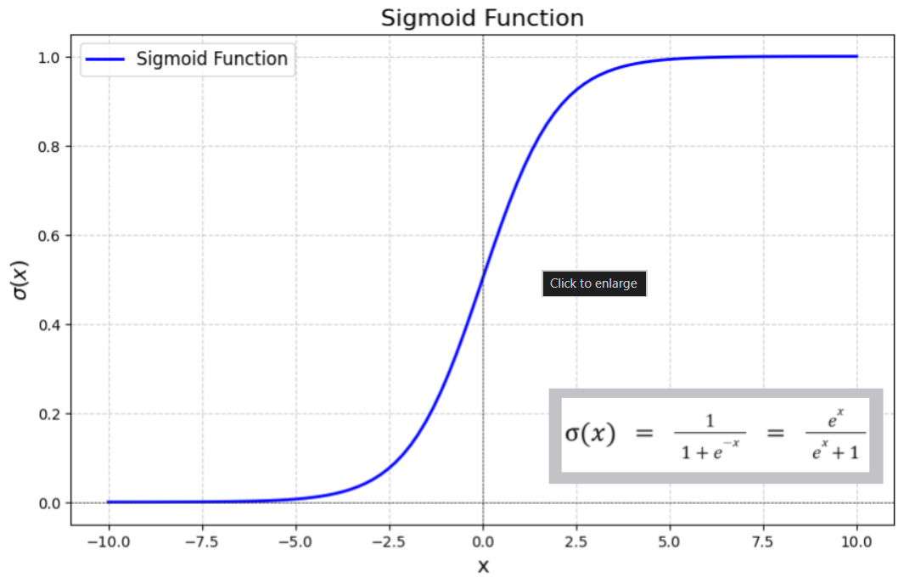
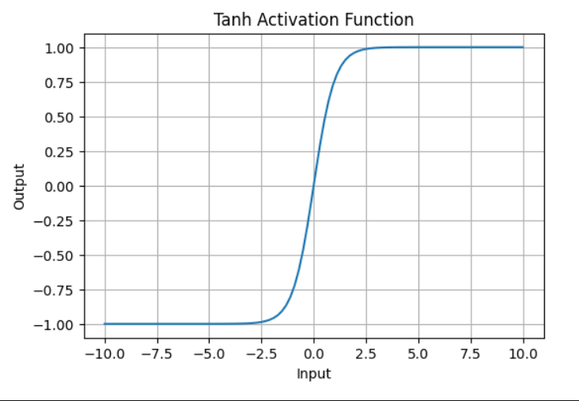
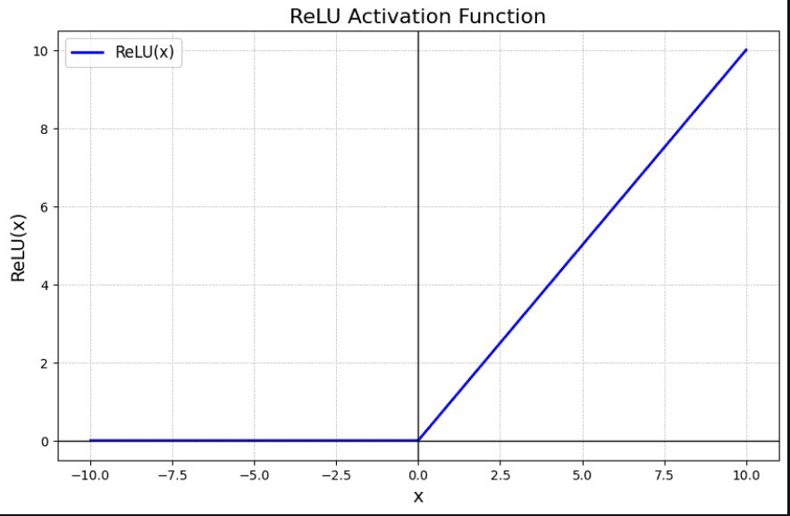
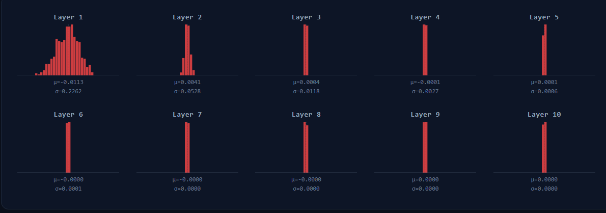

# Learnings from lecture 1

## Problems with Sigmoid

### 1. Vanishing gradients problem

> [!Note]  
> before reading this, understand [derivatives](https://github.com/Swayam-Alhat/dl-from-scratch/blob/main/concepts/Derivatives.md), [backpropagation](https://github.com/Swayam-Alhat/dl-from-scratch/blob/main/concepts/learnings.md#backprop) and [gradient descent](https://github.com/Swayam-Alhat/dl-from-scratch/blob/main/concepts/Derivatives.md#how-derivatives-are-used-in-neural-nets-to-reduce-loss-function)

> [!Note]  
> understand what is [functions, derivatives](https://github.com/Swayam-Alhat/dl-from-scratch/blob/main/concepts/Derivatives.md) , [backrpop](https://github.com/Swayam-Alhat/dl-from-scratch/blob/main/concepts/learnings.md#backprop) & [gradient descent](https://github.com/Swayam-Alhat/dl-from-scratch/blob/main/concepts/Derivatives.md#how-derivatives-are-used-in-neural-nets-to-reduce-loss-function) before understanding this problem.

When we use sigmoid function as an activation function, there will be a risk that gradients of sigmoid function will be almost 0. And as we know, during backprop, we apply chain rule to calculate to gradients of loss w.r.t each parameter. In chain rule, we multiply gradients of intermediate functions to get gradient of loss function w.r.t parameter.

Let me explain in more detail. Let's say for x = 10 or -10 is input to any sigmoid neuron. So, in this case, if we see the slope on graph, its almost zero.



here, we can see, sigmoid function squashes any real number value $x$ between 1.0 and 0.0

here's the actual values

derivative of sigmoid function is σ′(x)=σ(x)⋅(1−σ(x))

At x = 10: σ(10) ≈ 0.9999,
so
slope is σ'(10) = 0.9999 × 0.0001 ≈ 0.0000999

At x = -10: σ(-10) ≈ 0.0000454
so
slope is σ'(-10) = 0.0000454 × 0.9999 ≈ 0.0000454

At x = 10 & x = -10, derivative / gradients is almost zero. In this case, during backprop, while calculating gradients of loss function w.r.t each parameter, gradients will be multiplied with each other due to chain rule. Due to this, gradients get minimized. Almost zero. So, gradient descent to update weights does not work because gradients are very tiny. This rarely changes or updates weights/parameters

This stops learning of neural net. Further it leads to gradient vanishing problem.

That's sigmoid function are avoided to set as activation function because this saturated values or neuron generates value tiny gradients that stops learning of neural net

### 2. Sigmoid is not zero centered

Sigmoid function outputs values always between 0 and 1. These are always positive numbers. These positive outputs act as inputs to the neurons of the next layer.

During forward pass, this doesn't cause any problem. Forward pass just computes values and moves on.

The real problem shows up during **backpropagation**.

---

During backprop, neural network calculates gradients using chain rule. For any weight **w** in a layer, the gradient is:

```
∂L/∂w = upstream gradient × x
```

Here **x** is the local gradient of the weighted sum with respect to **w**. If the neuron computes `z = wx + b`, then `∂z/∂w = x`. So **x** is just the input value to that neuron — which is the sigmoid output of the previous layer. So **x** is always positive.

The **upstream gradient** is everything that came before this step in the chain rule — all the gradients multiplied together from the loss function up to this point. It is a single number that arrives from the right side during backprop, and it is the same value for every weight in that layer.

Now since x is always positive, the **sign of `∂L/∂w` is entirely decided by the upstream gradient**. The x part can never flip the sign. It can only scale the magnitude.

---

This is where the problem hits.

Every weight **w** in that layer has the same upstream gradient. And all their x values are positive. So **all weights end up with the same sign of gradient** — either all positive or all negative, depending on what the upstream gradient is.

---

Now remember how weights get updated:

```
w = w - learning_rate × gradient
```

If all gradients are positive → all weights decrease together.
If all gradients are negative → all weights increase together.

But to reach the optimal parameters, maybe **some weights need to increase and some need to decrease at the same time**. Due to this problem, that can never happen in a single step.

So the correct update gets pushed to the next iteration. Then maybe the next. This back and forth causes a **zig-zag path** toward the optimal solution instead of a straight efficient path — and this wastes time. Training still works, just **slower than it should be**.

---

This is exactly why sigmoid being non-zero-centered is a problem. Not because it breaks training. But because it makes training **unnecessarily slow**.

### 3. exp() is bit compute expensive

$e^{-x}$ is expensive to compute as compared to other activation functions

## Tanh(x)

Tanh(x) squashes numbers to range [-1,1]. Its a zero centered function



**But**, it still has some problems.

Like, it has saturation areas where gradients/slope is very tiny. This stops the gradient flow

Same as sigmoid, which kills gradients

## ReLU

In 2012 CNN research paper, it stated that ReLU i.e $f(x) = max(0, x)$ works efficiently and network converges quickly



Points that makes ReLU best choice

- It does not saturate at positive region. Means, we don't have vanishing gradient problem in positive region

- Its computationaly efficient because of threshold calculation
- Experimentally, it is proven that it converges faster

**But**,  
still, it has some problem

**Dead Neuron Problem in ReLU**

For negative inputs, ReLU outputs 0. During backprop, the local gradient of ReLU for any negative input is also 0.

Since gradient of this neuron is 0, when chain rule multiplies it with the upstream gradient — the result is 0. So **no gradient flows back through this neuron at all**. Every weight in every layer before this neuron, that depended on this path, receives zero gradient update. The entire backprop chain through this neuron is broken.

This is why it's called a **dead neuron** — it stops contributing to learning completely.

**How does a neuron die?**

If the learning rate is too large, weight updates can overshoot. The weights feeding into a neuron can shift to values where that neuron always receives negative input — for every sample in the dataset. Once that happens, the neuron always outputs 0, always produces zero gradient, and its weights never get updated again. It stays dead permanently for the rest of training.

**Why is this worse than it looks?**

A single dead neuron doesn't just stop learning itself — it silently removes an entire path of gradient flow from the network. If many neurons die (which can happen with a bad learning rate), a significant portion of your network becomes useless and you won't even notice it directly from the loss.

#### TLDR :

- Use ReLU. Be careful about learning rate
- Tryout Leaky ReLU, Maxout
- Try Tanh but don't expect much
- Don't use sigmoid

---

**Dead Neuron Problem in ReLU**

For negative inputs, ReLU outputs 0. During backprop, the local gradient of ReLU for any negative input is also 0.

Since gradient of this neuron is 0, when chain rule multiplies it with the upstream gradient — the result is 0. So **no gradient flows back through this neuron at all**. Every weight in every layer before this neuron, that depended on this path, receives zero gradient update. The entire backprop chain through this neuron is broken.

This is why it's called a **dead neuron** — it stops contributing to learning completely.

**How does a neuron die?**

If the learning rate is too large, weight updates can overshoot. The weights feeding into a neuron can shift to values where that neuron always receives negative input — for every sample in the dataset. Once that happens, the neuron always outputs 0, always produces zero gradient, and its weights never get updated again. It stays dead permanently for the rest of training.

**Why is this worse than it looks?**

A single dead neuron doesn't just stop learning itself — it silently removes an entire path of gradient flow from the network. If many neurons die (which can happen with a bad learning rate), a significant portion of your network becomes useless and you won't even notice it directly from the loss.

---

---

## Data preprocessing for images

**Why we need data preprocessing ?**

**The core idea: zero-centering your data**

Raw pixel values are in [0, 255]. Neural networks train better when input data is centered around zero. Here's why that matters for gradients — if all inputs are positive, the gradients on weights during backprop will all be the same sign, causing inefficient zigzag updates.

---

In practice, we use **mean centering**  
For each pixel position, compute its mean across the entire training set, then subtract.

**AlexNet used this**.

Another technique is, **Mean Subtraction per channel (subtract channel mean)**  
Instead of a per-pixel mean, you compute a single mean per color channel across all pixels and all images.  
You get just 3 numbers (one per channel). Much simpler and more commonly used today.  
 **VGGNet used this approach.**

## Weight initialization

**Weight initialization** is also a strong reason that leads to poor performance of neural nets.  
Early neural networks not worked well, may be due to this reason.

### Ways to initialize weights

#### 1. Initialize weights as zero

This initialization results in same output of all neurons in a layer. Meaning, all neurons are producing same values. During backprop, this results in having equal gradients of all weights in a layer. So, it does not break symmetry & all neurons learn same pattern resulting in poor performance of neural network

> [!Note]  
> Understand normal/gaussian distribution and standard deviation before reading further

#### 2. Unit Gaussian and scale it by 0.01

As initializing with equal constant values (like 0) don't work, **let's initialize weights with small random values**

This initialization samples values from unit Gaussian. Unit Gaussian is distribution where mean is 0 and standard deviation is 1. We take those values and scale them by 0.01 (multiply by 0.01 to make them smaller)

But, **why we scale them by 0.01 ?**

Before undertanding **why,** let's understand how **tanh** activation function works in neural network

**tanh function maps neural network inputs to a continuous output range between -1 and 1**


As you can see in above graph,  
tanh has valid slope for input values close to 0,

**But**, for large input values (+ve or -ve), tanh has almost 0 slope

**tanh function saturates at its extreme values**  
meaning, at its extreme output values (-1 & 1), it has almost zero slope.

In such case, during backpropagation, the gradient of tanh w.r.t its parameter $(x)$ will be almost zero. And as we know, chain rule is used to calculate gradient of loss function

$tanh(x) = T$  
$loss function = L$

$$ \frac{\partial L}{\partial x} = \frac{\partial T}{\partial x} \times \frac{\partial L}{\partial T}$$

This produces very tiny gradient, almost zero

This kills further gradient causing **vanishing gradient problem**

> [!Note]  
> **Short explaination on vanishing gradient problem**
>
> **_Large weights → weighted sum is large → tanh receives large input → tanh is at its extreme (output near ±1) → slope is nearly zero there._**  
> **During backprop, chain rule multiplies by this near-zero slope at every layer. Signal dies.**

So, for neural networks using tanh as activation function, input values (weighted sum) must be close to 0

To produce weighted sum close to 0, weights & inputs should close to 0 (tiny values)

For inputs to be small, we use feature scaling

For weights, we initialize it small random numbers (Unit Gaussian & scale by 0.01)

**That's why we scale unit Gaussian sample values by 0.01 and then set them as initial weights**

**_we use small values as initial weights of neural network so that weighted sum also has value close to 0 and tanh works properly_**

**But still it has a problem**

During forward pass, **activations** (vector of outputs of activation function) are almost 0 at deeper layers. The standard deviation also becomes 0.

Below is the histogram of activations at each layer



> **_distribution means histogram plot of values or points._**  
> **_activation distribution means histogram plotted for activation values of a layer_**

As we can see above, first layer has roughly unit gaussian distribution (meaning all points are properly distributed. its mean is 0 and std is 1). But as we go for next deeper layers, std becomes 0

Meaning all activations at each deeper layers are 0 thats why we can see activations are moving towards mean 0 and standard deviation is becoming 0

**Why all activations becomes ~0 ?**

All activations in further layers are 0. Means tanh outputs 0 for each inputs (weighted sum).  
This is because initially, all goes well & activations produced at 1st layer has a rough unit-gaussian distribution.  
But this activations are again passed to next layer as inputs which again performs weighted sum calculation and applies activation function.  
The weighted sums keep shrinking at each layer because weights are so small, so tanh keeps receiving tinier and tinier inputs, producing tinier and tinier outputs.

**This results in vanishing gradient problem during backprop**

> [!Note]  
> **This is how gradient vanishes**
>
> **_Small weights (×0.01) → weighted sum is tiny → tanh receives near-zero input → tanh output is also near zero → next layer receives near-zero inputs → repeat._**
>
> **_By deeper layers, all activations are ≈ 0. During backprop, gradient of loss w.r.t. weight is:_**  
>
> $$\frac{\partial L}{\partial w} = \frac{\partial L}{\partial a} \times x$$
>
> where $x$ is the input to that neuron, which is ≈ 0. So gradient ≈ 0. Signal dies again.

> [!IMPORTANT]  
> Proper Initialization is an active area of research.  
> Research papers are still coming out

But there is a technique which solves most of the problems

### Batch Normalization

explaination on Batch-Normalization :  
https://www.geeksforgeeks.org/deep-learning/what-is-batch-normalization-in-deep-learning/

research paper on batch normalization :  
https://arxiv.org/pdf/1502.03167

pdf is downloaded in device

In above paper, they defined the [Internel Covariant shift problem](https://www.geeksforgeeks.org/deep-learning/internal-covariant-shift-problem-in-deep-learning/) & then proposed **BatchNorm** as the fix

**_Understand the concepts so that we can use it in actual implementations of neural nets_**

### Tip: Overfit very small part of training data

Before starting actual training, make sure your neural network overfits very small part of training data. (generates 100% accuracy)  
If it overfits then good. If its not, something is wrong in neural network

## Hyperparameter optimization

It's simple, just experiment!

Second way is grid search or random search

> [!Note]  
> In reinforcement learning, we don't have stable training data distribution.  
> As we know, it involves interacting with environment (as environment is not symetrical), so it learns with data that has different distribution.  
> Like, first it looks at wall and learning from it, and then looks at road or objects which has different distributions.
