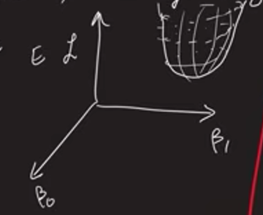
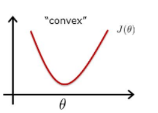
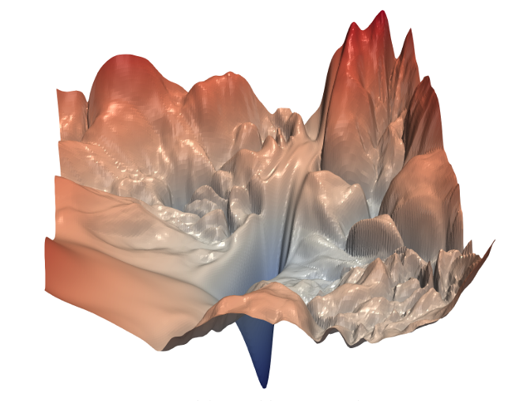
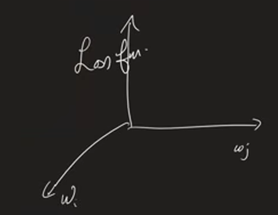
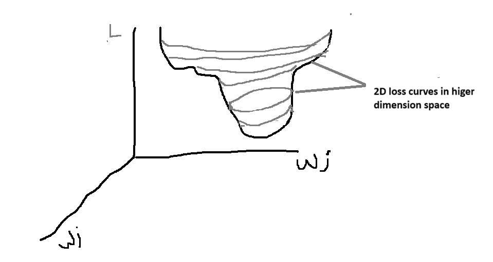
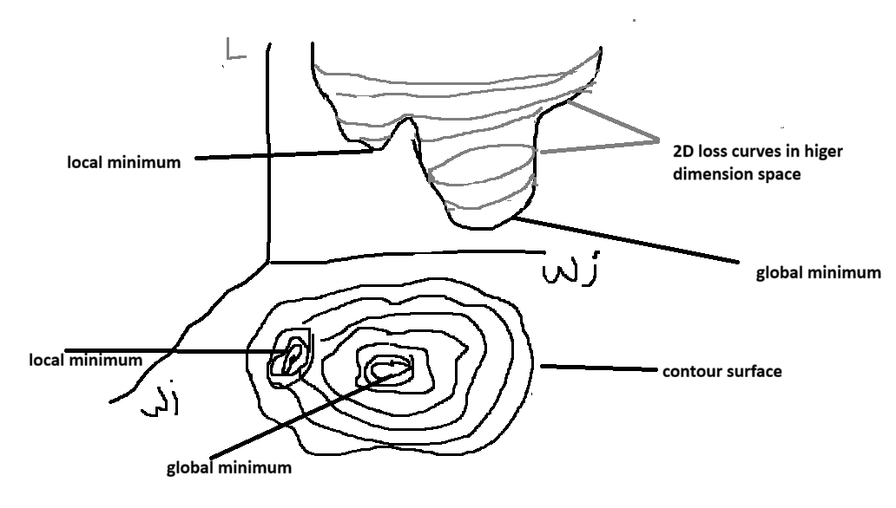

# Understanding a paper: Visualizing the Loss Landscape of Neural Nets

In this file, we are understanding paper "Visualizing the Loss Landscape of Neural Nets" with the help of youtube video

> minimizers = optimizers (like SGD, Adam)

For linear regression, **loss surface is a 2d surface (parabola) formed in 3d space**

As you can see, loss surface is 2D surface and its in 3D space. In 3D space, we have axis - $\beta_{0} , \beta_{1}$ & $L$

In the case of linear regression, loss function/loss surface is **convex**

> Convex means it forms a U shaped curve also called parabola. i.e only have 1 local minimum which is global minimum

Neural networks have **non-convex** loss function/loss surface. Means it has multiple local minima's and 1 global minima

> [!Note]  
> Techniques like batchnorm, weight decay, regularization, residual connections (skip connections) & small batch data enhances the performance of neural net

Basically, we know loss function in neural network have millions of weights. Loss is a function of $w_{1}$, $w_{2}$ ,...$w_{m}$

$$L (w_{1}, w_{2},...w_{m})$$

This forms a high dimensional loss surface

Now, this loss function is projected down to only have $w_{i}$ & $w_{j}$. i.e loss surface is reduced to low dimensional plane

$$L (w_{i}, w_{j})$$

This is another loss function but it reflects the properties of high dimensional loss surface

---

This is how we visualize higher dimensional loss surface

where $w_{i}$ and $w_{j}$ are vectors

Now, lets say, we got loss surface like this

In this gray color curves are 2D loss curves

If we project down loss surface on ground i.e on the plane formed by $w_{j}$ & $w_{i}$, we get a contour surface

